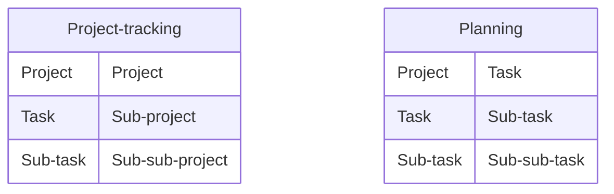

## Descripción general de la integración
Actualmente estás usando Asana para organizar tu trabajo por proyectos y tareas. Esta integración replica la estructura de tus tareas de Asana en Beebole, para que tus empleados puedan especificar el tiempo dedicado a cada tarea.

La estructura de Asana se puede replicar en el panel de Planificación de recursos de Beebole o en su estructura de seguimiento de tiempo por Proyecto, que puedes aprovechar con costos, facturación y gastos, para un mayor control financiero.

Todos tus proyectos y tareas se sincronizarán automáticamente, así que no necesitas preocuparte por el mantenimiento dual. La sincronización automática con Asana se puede detener y reanudar en cualquier momento.

### Requisitos de suscripción

<Info>La integración con Asana está disponible en todos los planes Pro y Enterprise. Asegúrate de tener privilegios de Administrador tanto en Asana como en Beebole antes de comenzar.</Info>

### Qué se sincroniza desde Jira
* **Proyectos:** Importados como Proyectos o Tareas de Beebole.
* **Tareas:** Importadas como Subproyectos o Subtareas de Beebole.
* **Subtareas:** Importadas como Sub-subproyectos o Sub-subtareas de Beebole.
* **Usuarios:** Los usuarios activos de Asana se asocian como personas en Beebole.

### Qué permanece en Beebole
* **Flujos de aprobación:** Beebole gestiona el ciclo de vida de la hoja de horas.
* **Tarifas de facturación:** Gestionadas exclusivamente en los proyectos de Beebole.
* **Presupuestos:** Definidos en el módulo financiero de Beebole.

## Qué está incluido
<AccordionGroup>
  <Accordion title="Proyectos, tareas y subtareas de Asana">
    Los proyectos y tareas activos en el momento de habilitar la integración se crearán en Beebole. Cualquier cambio de nombre en esas tareas se reflejará en Beebole mientras la integración esté activa. Los nuevos proyectos y tareas también se crearán automáticamente en Beebole.
  </Accordion>

  <Accordion title="Usuarios de Asana">
    Todos los usuarios activos en Asana se crearán automáticamente en Beebole al habilitar la integración por primera vez. El rol de estos usuarios en Beebole debe ser especificado.
  </Accordion>

  <Accordion title="Elementos adicionales que permanecen en Beebole">
    Las entradas de la hoja de horas, el proceso de aprobación, las tarifas de facturación, los presupuestos y los gastos se mantendrán en Beebole.
  </Accordion>
</AccordionGroup>

## Configuración paso a paso
<Steps>
    <Step title="Conectarse a Asana">Ve a **Configuración >> Integraciones >> Asana**. Haz clic en el botón para conectarte a tu cuenta de Asana.  
      Sigue las instrucciones de la ventana emergente para conectarte a tu cuenta de Asana. La ventana se cerrará automáticamente cuando se complete la autenticación.</Step>
    <Step title="Configurar los parámetros de integración">Si tu cuenta de Asana está vinculada a más de un espacio de trabajo,
    selecciona el que deseas sincronizar con Beebole. Selecciona el _Rol_ predeterminado a usar para los empleados durante el proceso de importación. (*)_Puedes revisar los roles existentes en *Configuración >> Roles de personas* si es necesario._ 
    Define si deseas importar tus tareas para Planificación y asignación o para seguimiento de tiempo por proyecto y tarifas. </Step>
    <Step title="Habilitar la integración">Haz clic en el interruptor para habilitar la integración. El sistema importará todos tus proyectos y tareas activos.
    _Ten en cuenta que esto puede tardar unos momentos dependiendo de tu cuenta de Asana_.
    Puedes navegar y usar la aplicación mientras el proceso de integración continúa. Una vez completado, la integración estará habilitada y todos los cambios de Asana se reflejarán en Beebole.</Step>
    <Step title="Validar la integración">Haz clic en el icono de Proyectos en el menú izquierdo para ir a la página de Proyectos. Expande las categorías. Deberías ver una nueva categoría llamada Asana que incluye todos tus proyectos y tareas. Puedes cambiar el nombre de la categoría si lo necesitas. </Step>
    <Step title="Configurar la hoja de horas">Si deseas que la nueva categoría se use en la Hoja de horas, ve a **Configuración >> Configuración de la cuenta >> Configuración de la hoja de horas** y selecciona la categoría Asana.</Step>
</Steps>

## Preguntas frecuentes (FAQ)
<AccordionGroup>
  <Accordion title="¿Cuál es la diferencia entre Proyectos y actividades vs Planificación y tareas?">
    La gestión del tiempo de Beebole se divide en dos secciones, Proyectos y Planificación. Los Proyectos se pueden configurar con tarifas de facturación, costos, presupuesto y gastos. La Planificación es una lista de tareas que puedes asignar en diferentes gráficos. Ambos se pueden usar en la hoja de horas para registrar el tiempo. Para más detalles, ve a **Enlace interno a la explicación principal entre Proyectos y Planificación**.
  </Accordion>

  <Accordion title="¿Con qué frecuencia se sincroniza Beebole con Asana?">
    Cada vez que actualizas o creas un proyecto o una tarea en Asana, se reflejará inmediatamente en Beebole. A veces, debido a la congestión de la red o las colas de datos, puede tardar desde unos minutos hasta unas pocas horas. Si tu cambio no se refleja en Beebole en 24 horas, por favor contáctanos.
  </Accordion>
</AccordionGroup>