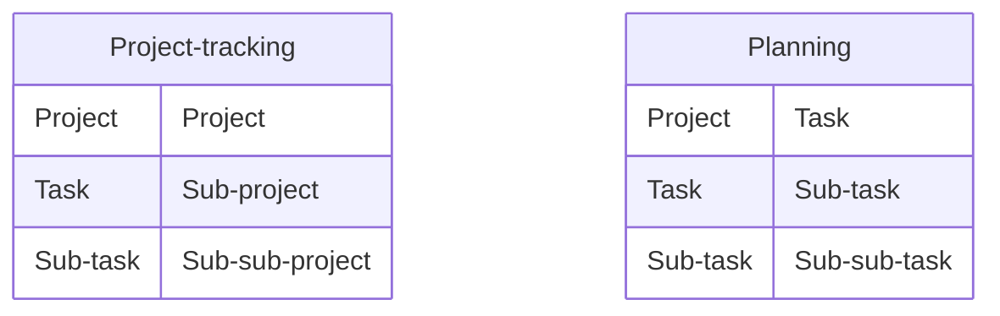

## Integration Overview
You are currently using Asana to organize your work by projects and tasks. This integration replicates your Asana task structure in Beebole, so your employees can specify the time spent on every task.

The Asana structure can be replicated into Beebole's Resource Planning dashboard or its Project time tracking structure, which you can leverate with costs, billing and expenses, for further financial control.

All your projects and tasks will be automatically synchronized so no need to worry about dual maintenance. The automatic Asana synchronization can be stopped and continued at any point in time.

### Subscription requirements

<Info>The Asana integration is available on all Pro and Enterprise plans. Ensure you have Administrative privileges in both Asana and Beebole before starting.</Info>

### What syncs from Jira
* **Projects:** Imported as Beebole Projects or Tasks.
* **Tasks:** Imported as Beebole Sub projects or Sub tasks.
* **Sub Tasks:** Imported as Beebole Sub sub projects or Sub sub tasks.
* **Users:** Asana active users are mapped as Beebole people.

### What stays in Beebole
* **Approval Workflows:** Beebole handles the timesheet lifecycle.
* **Billing Rates:** Managed exclusively in Beebole projects.
* **Budgets:** Set within Beebole's financial module.

## What's included
<AccordionGroup>
  <Accordion title="Asana projects, tasks and sub-tasks">
    Active projects and tasks at the time of enabling the integration will be created in Beebole. Any name change to those tasks will be reflected in Beebole while the integration is active. New projects and task will also be automatically created in Beebole
  </Accordion>

  <Accordion title="Asana users">
    All active users in Asana will be automatically created in Beebole when first enabling the integration. The role for these users in Beebole needs to be specified
  </Accordion>

  <Accordion title="Additional items staying in Beebole">
    Timesheet entries, approval process, billing rates, budgets and expenses will be maintained in Beebole
  </Accordion>
</AccordionGroup>

## Step by step configuration
<Steps>
    <Step title="Connect to Asana">Go to **Settings >> Integrations >> Asana**. Click on the button to connect to your Asana account.  
      Follow the instructions on the popup to connect to your Asana account. The popup will automatically close when the authentication is completed.</Step>
    <Step title="Configure integration parameters">If your Asana account is linked to more than one workspace, 
    select the one you want to sync with Beebole. Select default _Role_ to use for employees during the import process. (*)_You can review existing roles via *Settings >> Person roles* if needed._ 
    Define whether you want to import your tasks for Planning and assignment or for project time tracking and rates. </Step>
    <Step title="Enable integration">Click on the toggle to enable the integration. The system will import all your active projects and tasks into the system. 
    _Please note that this can take a few moments depending on your Asana account_.
    You can navigate and use the application while the integration process continues. Once completed, the integration is enabled and all changes from Asana will be reflected in Beebole.</Step>
    <Step title="Validate integration">Click on the Projects icon on the left menu to go to the Projects page. Expand the categories. You should see a new category call Asana including all your projects and tasks. Feel free to change the name of the category if needed. </Step>
    <Step title="Configure timesheet">If you want the new category to be used in the Timesheet, go to **Settings >> Account Settings >> Timesheet Settings** and select the Asana category.</Step>
</Steps>

## Frequently Asked Questions (FAQ)
<AccordionGroup>
  <Accordion title="What is the difference between Projects and activities vs Planning and tasks ">
    Beebole's time management is split in two sections, Projects and Planning. Projects can be configured with billing rates, costs, budget and expenses. Planning is a list of tasks that you can assign in different charts. Both can be used in the timesheet to track time. For additional details, go to **Internal link to main explanation between Projets and Planning**. 
  </Accordion>

  <Accordion title="How often is Beebole synchronized with Asana?">
    Every time you update or create a project or a task in Asana, it will inmediately reflected in Beebole. Sometimes, due to network congestion or data queues, it might take a few minutes up to a few hours. If your change is not reflected in Beebole in 24 hours, please contact us.
  </Accordion>
</AccordionGroup>