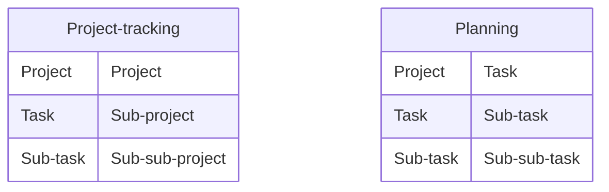

Beebole's Asana integration imports your Asana projects, tasks, and sub-tasks into Beebole so your team can track time against their Asana work. The integration keeps your Asana workspace and Beebole account in sync automatically -- when a project or task is created or renamed in Asana, the change is reflected in Beebole.

You can import your Asana structure into Beebole's **Projects and activities** for time tracking with costs, billing, and expenses, or into **Planning and tasks** for resource assignment.

```mermaid actions={false}
erDiagram
    Project-tracking {
        Project Project
        Task Sub-project
        Sub-task Sub-sub-project
    }
    Planning {
        Project Task
        Task Sub-task
        Sub-task Sub-sub-task
    }
```

---

## Subscription requirements

<Info>The Asana integration is available on Pro and Enterprise plans. You need administrative privileges in both Asana and Beebole to set up the integration.</Info>

| What syncs from Asana | What stays in Beebole |
|---|---|
| **Projects:** Imported as Beebole projects or tasks. | **Approval workflows:** Beebole handles the timesheet lifecycle. |
| **Tasks:** Imported as Beebole sub-projects or sub-tasks. | **Billing rates:** Managed exclusively in Beebole. |
| **Sub-tasks:** Imported as Beebole sub-sub-projects or sub-sub-tasks. | **Budgets:** Set within Beebole's financial module. |
| **Users:** Asana active users are mapped as Beebole people. | |

---

## What's included

<AccordionGroup>
  <Accordion title="Asana projects, tasks, and sub-tasks">
    Active projects, tasks, and sub-tasks at the time of enabling the integration are created in Beebole. Any name change to those items is reflected in Beebole while the integration is active. New projects and tasks created in Asana are also automatically added to Beebole.
  </Accordion>

  <Accordion title="Asana users">
    All active users in your Asana workspace are automatically created as people in Beebole when you first enable the integration. You choose a default role for these imported employees during setup.
  </Accordion>

  <Accordion title="Items managed in Beebole">
    Timesheet entries, approval workflows, billing rates, budgets, and expenses remain in Beebole and are not affected by the integration.
  </Accordion>
</AccordionGroup>

---

## Step-by-step configuration

<Steps>
  <Step title="Connect to Asana">
    Go to **Settings** > **Integrations** > **Asana**. Click **Connect to Asana**.

    <Frame caption="Beebole Asana integration connect button">
      
    </Frame>

    Follow the instructions in the popup to authorize Beebole to access your Asana workspace. The popup closes automatically when the connection is complete.
  </Step>
  <Step title="Configure integration parameters">
    Once connected, configure the following options:

    - **Workspace** -- If your Asana account is linked to more than one workspace, select the one you want to sync with Beebole.
    - **Default role for imported employees** -- Select the role to assign to Asana users when they are imported into Beebole.
    - **Where to import your tasks** -- Choose between **Projects and activities** (for project time tracking with rates and billing) or **Planning and tasks** (for resource planning and assignment).

    <Frame caption="Beebole Asana integration parameters">
      
    </Frame>

    <Tip>You can review and manage existing roles in **Settings** > **Person roles**.</Tip>
  </Step>
  <Step title="Enable the integration">
    Click the toggle to **Enable integration**. Beebole imports all your active Asana projects, tasks, and sub-tasks.

    <Frame caption="Beebole Asana integration updating">
      
    </Frame>

    <Note>The initial import may take a few moments depending on the size of your Asana workspace. You can continue using Beebole while the import runs in the background.</Note>

    Once complete, the integration is active. All future changes in Asana are automatically reflected in Beebole.
  </Step>
  <Step title="Validate the integration">
    Click the **Projects** icon in the left menu to open the Projects page. Expand the categories -- you should see a new category called **Asana** containing all your imported projects and tasks. You can rename this category if needed.

    <Frame caption="Beebole projects page showing imported Asana category">
      
    </Frame>
  </Step>
  <Step title="Configure the timesheet">
    If you want the new Asana category to appear in the timesheet, go to **Settings** > **Account Settings** > **Timesheet Settings** and select the Asana category.
  </Step>
</Steps>

---

## Disabling the integration

<Warning>If you disable the integration, any future changes made in Asana will no longer sync to Beebole. Previously imported data remains in Beebole as local records.</Warning>

To disable the integration, go to **Settings** > **Integrations** > **Asana** and toggle the integration off. You can re-enable it at any time to resume syncing.

To disconnect your Asana account entirely, click **Reset connection**.

---

## Related content

<CardGroup cols={2}>
  <Card title="Projects and activities" icon="folder" href="/help/documentation/projects">
    Manage your projects, sub-projects, and billing rates in Beebole.
  </Card>
  <Card title="Planning and tasks" icon="calendar-check" href="/help/documentation/planning">
    Assign tasks and manage resource planning across your team.
  </Card>
  <Card title="Custom integrations" icon="code" href="/help/integrations/custom-integrations">
    Build your own integrations using the Beebole GraphQL API.
  </Card>
  <Card title="All integrations" icon="plug" href="/help/integrations/introduction">
    Explore all available Beebole integrations.
  </Card>
</CardGroup>

---

## Frequently asked questions

<AccordionGroup>
  <Accordion title="What is the difference between Projects and activities and Planning and tasks?">
    Beebole's time management has two structures. **Projects and activities** can be configured with billing rates, costs, budgets, and expenses. **Planning and tasks** is a list of tasks you can assign in resource planning charts. Both can be used in the timesheet to track time. Choose the option that best fits how your organization manages work.
  </Accordion>

  <Accordion title="How often does Beebole sync with Asana?">
    Changes made in Asana (new projects, tasks, or name updates) are reflected in Beebole automatically via webhooks. In most cases this happens within minutes. If a change is not reflected within 24 hours, contact [support@beebole.com](mailto:support@beebole.com).
  </Accordion>

  <Accordion title="Can I choose which Asana projects to import?">
    The integration imports all active projects and tasks from your Asana workspace. You cannot selectively import individual projects. However, you can organize and filter imported items within Beebole after the import.
  </Accordion>

  <Accordion title="What happens to imported data if I disable the integration?">
    All previously imported projects, tasks, and people remain in Beebole as local records. They are not deleted. Only future changes from Asana will stop syncing until you re-enable the integration.
  </Accordion>

  <Accordion title="Do I need admin access in both Asana and Beebole?">
    Yes. You need administrative privileges in both your Asana workspace and your Beebole account to set up and configure the integration.
  </Accordion>
</AccordionGroup>
