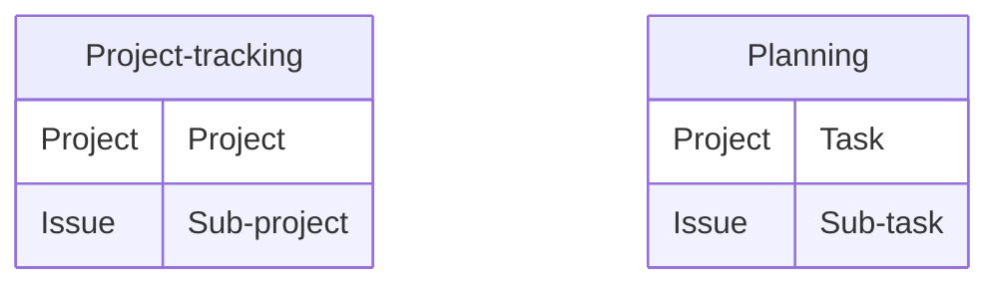

Beebole's Jira integration imports your Jira projects and issues into Beebole so your team can track time against their Jira work. The integration keeps your Jira Cloud site and Beebole account in sync automatically -- when a project or issue is created or updated in Jira, the change is reflected in Beebole.

You can import your Jira structure into Beebole's **Projects and activities** for time tracking with costs, billing, and expenses, or into **Planning and tasks** for resource assignment.

---

## Subscription requirements

<Info>The Jira integration is available on Pro and Enterprise plans. You need administrative privileges in both Jira and Beebole to set up the integration.</Info>

| What syncs from Jira | What stays in Beebole |
|---|---|
| **Projects:** Imported as Beebole projects or tasks. | **Approval workflows:** Beebole handles the timesheet lifecycle. |
| **Issues:** Imported as Beebole sub-projects or sub-tasks. | **Billing rates:** Managed exclusively in Beebole. |
| **Users:** Jira users are mapped as Beebole people. | **Budgets:** Set within Beebole's financial module. |

---

## What's included

<AccordionGroup>
  <Accordion title="Jira projects and issues">
    Active projects and issues at the time of enabling the integration are created in Beebole. Any name change to those items is reflected in Beebole while the integration is active. New projects and issues created in Jira are also automatically added to Beebole.
  </Accordion>

  <Accordion title="Jira users">
    All active users in your Jira site are automatically created as people in Beebole when you first enable the integration. You choose a default role for these imported employees during setup.
  </Accordion>

  <Accordion title="Items managed in Beebole">
    Timesheet entries, approval workflows, billing rates, budgets, and expenses remain in Beebole and are not affected by the integration.
  </Accordion>
</AccordionGroup>

---

## Step-by-step configuration

<Steps>
  <Step title="Connect to Jira">
    Go to **Settings** > **Integrations** > **Jira**. Click **Connect to Jira**.

    Follow the instructions in the popup to enter your Jira Cloud URL and authorize Beebole to access your Jira site. The popup closes automatically when the connection is complete.
  </Step>
  <Step title="Configure integration parameters">
    Once connected, configure the following options:

    - **Where to import your issues** -- Choose between **Projects and activities** (for project time tracking with rates and billing) or **Planning and tasks** (for resource planning and assignment).
    - **Default role for imported employees** -- Select the role to assign to Jira users when they are imported into Beebole.

    <Tip>You can review and manage existing roles in **Settings** > **Person roles**.</Tip>
  </Step>
  <Step title="Enable the integration">
    Click the toggle to **Enable integration**. Beebole imports all your active Jira projects and issues.

    <Note>The initial import may take a few moments depending on the size of your Jira site. You can continue using Beebole while the import runs in the background.</Note>

    Once complete, the integration is active. All future changes in Jira are automatically reflected in Beebole.
  </Step>
  <Step title="Validate the integration">
    Click the **Projects** icon in the left menu to open the Projects page. Expand the categories -- you should see a new category called **Jira** containing all your imported projects and issues. You can rename this category if needed.
  </Step>
  <Step title="Configure the timesheet">
    If you want the new Jira category to appear in the timesheet, go to **Settings** > **Account Settings** > **Timesheet Settings** and select the Jira category.
  </Step>
</Steps>

---

## Disabling the integration

<Warning>If you disable the integration, any future changes made in Jira will no longer sync to Beebole. Previously imported data remains in Beebole as local records.</Warning>

To disable the integration, go to **Settings** > **Integrations** > **Jira** and toggle the integration off. You can re-enable it at any time to resume syncing.

To disconnect your Jira account entirely, click **Reset connection**.

---

## Frequently asked questions

<AccordionGroup>
  <Accordion title="What is the difference between Projects and activities and Planning and tasks?">
    Beebole's time management has two structures. **Projects and activities** can be configured with billing rates, costs, budgets, and expenses. **Planning and tasks** is a list of tasks you can assign in resource planning charts. Both can be used in the timesheet to track time. Choose the option that best fits how your organization manages work.
  </Accordion>

  <Accordion title="How often does Beebole sync with Jira?">
    Changes made in Jira (new projects, issues, or name updates) are reflected in Beebole automatically. In most cases this happens within minutes. If a change is not reflected within 24 hours, contact [support@beebole.com](mailto:support@beebole.com).
  </Accordion>

  <Accordion title="Can I choose which Jira projects to import?">
    The integration imports all active projects and issues from your Jira site. You cannot selectively import individual projects. However, you can organize and filter imported items within Beebole after the import.
  </Accordion>

  <Accordion title="Does the integration work with Jira Server or Data Center?">
    The Beebole integration is designed for Jira Cloud. If you use Jira Server or Data Center, contact [support@beebole.com](mailto:support@beebole.com) to discuss options.
  </Accordion>

  <Accordion title="What happens to imported data if I disable the integration?">
    All previously imported projects, issues, and people remain in Beebole as local records. They are not deleted. Only future changes from Jira will stop syncing until you re-enable the integration.
  </Accordion>
</AccordionGroup>
